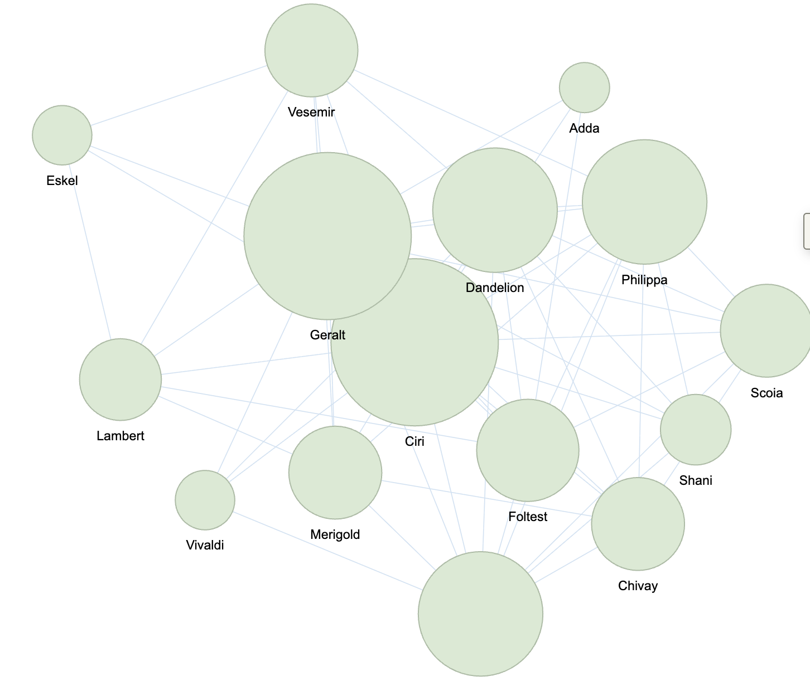

# Сетевой анализ персонажей «Перси Джексона»

## О проекте

Мой будущий итоговый проект посвящён сетевому анализу персонажей книжной серии Рика Риордана «Перси Джексон и Олимпийцы». В центре внимания находится структура отношений между персонажами: кто с кем взаимодействует, какие герои занимают центральное положение и как устроены группы внутри повествования.

Сетевой анализ позволяет представить литературный текст как систему связей. 
Проект показывает, как цифровые методы могут использоваться в литературоведении. Простая визуализация сети помогает увидеть, какие персонажи являются наиболее значимыми для структуры сюжета, какие группы героев связаны между собой и какие персонажи выполняют роль «мостов» между разными частями истории.

## Этапы работы

1. Мы берем одну книгу (возможно две, если результат будет небольшим)
2. Составляем список персонажей.
3. Выделяем взаимодействия между персонажами.
4. Создаем таблицу связей: персонаж A, персонаж B, тип связи, сила связи.
5. Строим граф персонажей.
6. Анализируем центральность, плотность сети и группы внутри графа.
7. Сравниваем полученные результаты с ролью персонажей в сюжете.

## Почему это важно

> Книги Перси Джексона обладают огромным количеством персонажей и пересечением их личных историй, поэтому мне было бы интересно их проследить.

## Источники и данные

Для проекта можно использовать несколько типов материалов:

* тексты книг серии «Перси Джексон и Олимпийцы»;
* готовый датасет по первым пяти книгам;
* список основных и второстепенных персонажей;

Вот пример [готового датасета по Перси Джексону](https://www.kaggle.com/datasets/shobhit043/percy-jackson-first-5-books).

## Пример структуры данных

| Персонаж A    | Персонаж B       | Тип связи             |
| ------------- | ---------------- | --------------------- |
| Перси Джексон | Аннабет Чейз     | дружба / союзничество |
| Перси Джексон | Гроувер Ундервуд | дружба                |
| Перси Джексон | Люк Кастеллан    | конфликт              |

## Пример кода

Ниже приведён пример кода, который может использоваться для создания простой таблицы связей между персонажами:

```python
import pandas as pd

edges = pd.DataFrame({
    "source": ["Перси Джексон", "Перси Джексон", "Перси Джексон"],
    "target": ["Аннабет Чейз", "Гроувер Ундервуд", "Люк Кастеллан"],
    "relation": ["friendship", "friendship", "conflict"]
})

print(edges)
```


